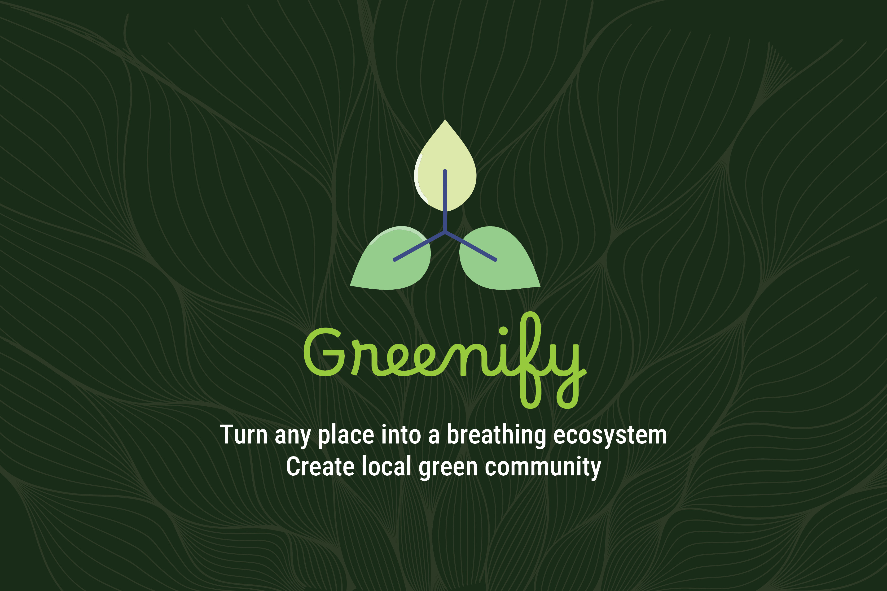

## Inspiration

The inspiration for Greenify stems from the growing need to address environmental challenges and promote sustainable living. With the rise of urbanization and technology, we wanted to create a platform that merges innovation with eco-consciousness. Greenify aims to empower individuals and communities to take actionable steps toward a greener future by leveraging technology to make sustainability accessible and engaging.

## What it does

Greenify is a mobile application designed to encourage and facilitate sustainable practices. It provides users with tools and resources to:

- Participate in community-driven eco-friendly challenges and initiatives.
- Access a curated library of tips, guides, and resources for sustainable living.
- Connect with like-minded individuals through a community platform to share ideas and inspire action.

The app is designed to be user-friendly, visually appealing, and impactful, making it easier for users to integrate sustainability into their daily lives.

## How we built it

Greenify was built using the [Expo](https://expo.dev) framework, which allowed us to create a cross-platform application for Android, iOS, and the web. Key technologies and tools used include:

- **Frontend**: React Native with Expo for building the user interface and ensuring a seamless user experience.
- **Backend**: A Python-based service using Flask to handle data processing and API endpoints.
- **Gemini AI**: Using Google's Gemini models to classify image, plant suggestions based on image and coordinates by realtime research, creating a community by matching users of similar plant suggestions
- **Design**: Using React Native UI Kitten for custom themes and assets, including fonts and icons, to create a visually cohesive and engaging interface.
- **File-based routing**: Leveraging Expo's file-based routing system for intuitive navigation.
- **Community features**: Implemented using React Native components and hooks for real-time interaction.

## Challenges we ran into

Building Greenify came with its share of challenges:

1. **Cross-platform compatibility**: Ensuring the app worked seamlessly across Android, iOS, and web platforms required extensive testing and debugging.
2. **Performance optimization**: Managing animations and dynamic content without compromising performance was a significant hurdle.
3. **Community features**: Implementing real-time interactions and ensuring scalability for community-driven features posed technical challenges.
4. **Design consistency**: Maintaining a consistent and appealing design across different screen sizes and resolutions required meticulous attention to detail.

## Accomplishments that we're proud of

- Successfully creating a fully functional cross-platform app within a limited timeframe.
- Properly utilizing Google Gemini APIs for image classifications, plant suggestions and community creation
- Designing an intuitive and visually appealing user interface that aligns with the app's eco-friendly theme.
- Implementing community-driven features that foster collaboration and engagement among users.
- Developing a robust backend service to handle data processing and API requests efficiently.

## What we learned

Throughout the development of Greenify, we gained valuable insights into:

- The intricacies of cross-platform app development using Expo and React Native.
- Best practices for optimizing performance in mobile applications.
- The importance of user-centric design in creating engaging and impactful applications.
- Strategies for integrating community-driven features into a mobile app.
- Extensive use of easy-to-use Gemini APIs

## What's next for Greenify

We have ambitious plans for the future of Greenify, including:

- **Gamification**: Introducing rewards and badges to incentivize sustainable practices.
- **Integration with IoT devices**: Enabling users to connect their smart home devices for real-time energy monitoring and optimization.
- **Expanded community features**: Adding forums, events, and leaderboards to enhance user engagement.
- **Localization**: Expanding the app's reach by supporting multiple languages and regional content.

Greenify is just the beginning of our journey toward creating a more sustainable world. We are excited to continue innovating and making a positive impact on the environment and society.


## How to run
This is an [Expo](https://expo.dev) project created with [`create-expo-app`](https://www.npmjs.com/package/create-expo-app). Also there is a ```/service``` folder in the root directory of the project which contains the Flask API for communicating between frontend and Gemini API.

1. Install dependencies

   ```bash
   npm install
   ```

2. Start the app

   ```bash
   npx expo start
   ```

In the output, you'll find options to open the app in a

- [development build](https://docs.expo.dev/develop/development-builds/introduction/)
- [Android emulator](https://docs.expo.dev/workflow/android-studio-emulator/)
- [iOS simulator](https://docs.expo.dev/workflow/ios-simulator/)
- [Expo Go](https://expo.dev/go), a limited sandbox for trying out app development with Expo

3. In another terminal navigate to ```/service``` folder and install dependencies
```bash
pip install -r requirements.txt
```
4. Set ```GEMINI_API_KEY``` in ```.env``` file inside the ```/service``` folder (create ```.env``` file if doesn't exist)
4. Run Flask app
```bash
python app.py
```
5. To open app in mobile
##### Option 1
* Install Expo Go app from Play Store or App Store
* Scan the QR code shown in the terminal

##### Option 2
Open web browser in your smartphone and navigate to the URL shown in the console.
